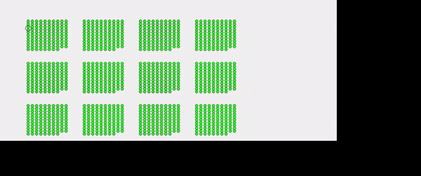

# First challenge: Circular Led Test for JBS

This is a repository storing the results of homework by Ivan Bichenko that is a part of candidate selection process for Creative Technologist position at JBS.

The task has 4 parts.
1. Connection diagram for low current wiring and power supply are found in file `Prototype Design.pdf` and below.
I based the design of the prototype on the recommendations from the task description. 3 splitters should provide 25 fps update rate. Control and power drivers are separated for more convenient hardware debugging. But in real life the configuration of test stand is usually based on the equipment available.


2. Power calculations are pretty straightforward. I propose three 24 V 150 Watt drivers, that might sound as an overkill, but as we are building a prototype we could use extra power. Something like Mean Well HLG-150H-24A would be ok.

3. Python script in this repository is a testing program. As the task included a very detailed description of timing requirements, I added the scheduling management capability. For testing purposes I added some simple LED and Splitter simulations and the graphical output.

To run the script you need `Python 3.10` installed. Once you have cloned current repository to your local machine please install `Pipenv`
```
pip install --user pipenv
```
The next step is to run in the project folder
```
pipenv install
```
To run the script please run
```
pipenv run python main.py  
```
You would see the following in the console


These are the headers received by the Splitter model from UDP port. The format is `<timestamp in microseconds>:<Splitter IP>:<Header data>`. This could be used for timing debug and package monitoring.

The following image will also appear in the new window:

These are the results of UDP package processing by the Splitter model. Each circle represents a LED. A group of circles is a node (only primary board is supported). Each row of groups represents a Splitter. And a column is a Splitter port output. 

4. Test function loops test scenarios: R,G,B pure colors applied all LEDs, all white, all off, gradual fading for each port.




## Second Challenge

To give an optimal solution for the tracking the following factors should be considered first:
- how precise the tracking should be? Should we recognise and track people's faces, their silhouettes or general murky outlines?
- what are the lighting conditions? Is it a dark corridor or a well-lit large room?
- what should we do with the tracking data? Map it onto a low resolution LED nodes or (if there is a LED/OLED display in the middle) should we have precise coordinates of the face/skeleton?

But in any case if we are dealing with tracking a camera should be used. The choice is 2D or 3D. In case of well lit room and no heavy requirement on the resolution of a tracked data, standard 2D CCTV cameras with real-time data output could be used. If the environment is dark an infrared enabled camera could be used. In case of tight budget a number of webcams with custom-made OpenCV software could be the solution. In my experience a very simple motion detection algorithm is sufficient for discrete interactivity.

If the resolution requirements are high, a passive or active 3D camera is the choice. Stereolabs ZED works well in a well-lit environment and will provide a 15-meter range for tracking. Intel IntelliSense being an active depth sensor will work in absolute darkness, but the range and framerate is lower. The advantage of these solutions is a ready-to-use SDK and a possibility to chain cameras together.  