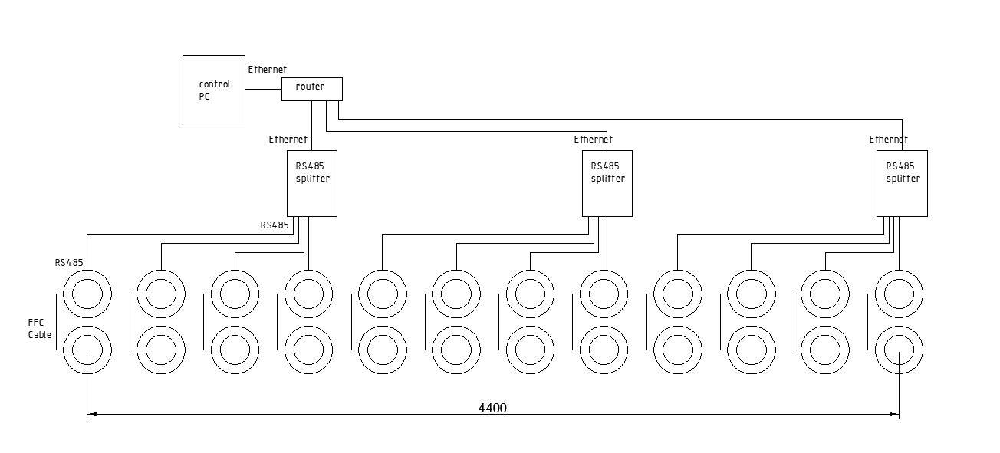
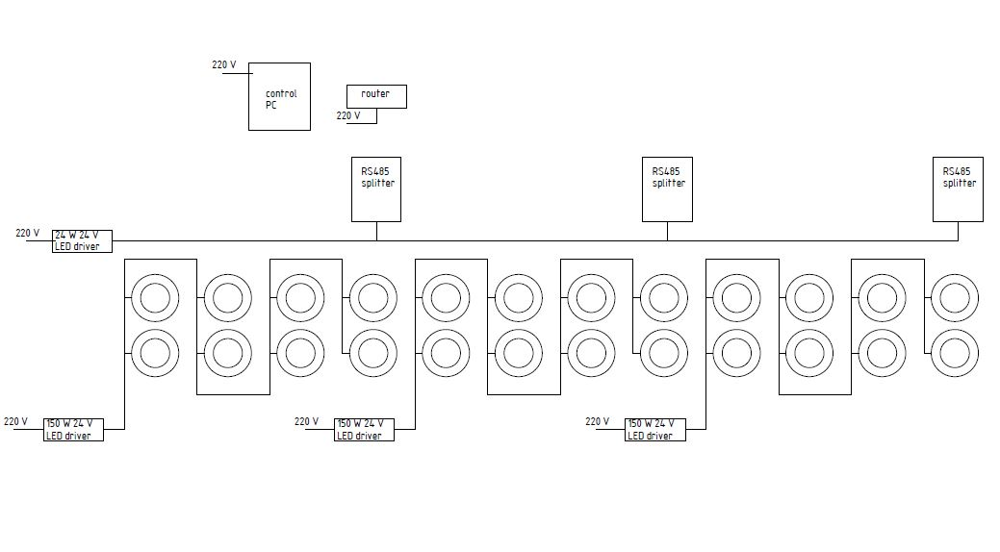
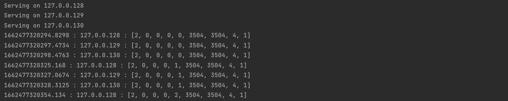
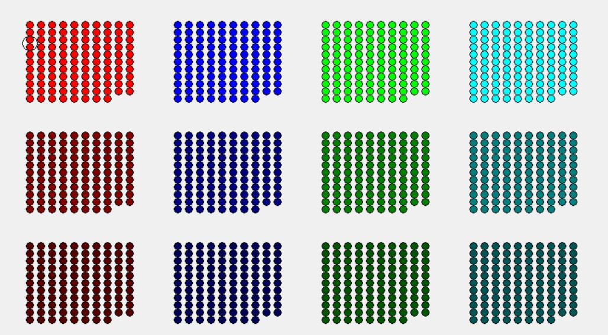

# Circular Led Test for JBS

This is a repository storing the results of homework by Ivan Bichenko that is a part of candidate selection process for Creative Technologist position at JBS.

The task has 4 parts.
1. Connection diagram for low current wiring and power supply are found in [file](Prototype Design.pdf).
I based the design of the prototype on the recommendations from the task description. 3 splitters should provide 25 fps update rate. Control and power drivers are separated for more convenient hardware debugging. But in real life the configuration of test stand is usually based on the equipment available.



2. Power calculations are pretty straightforward. I propose three 24 V 150 Watt drivers, that might sound as an overkill, but as we are building a prototype we could use extra power. Something like Mean Well HLG-150H-24A would be ok.

3. Testing program is a Python script in this repository. As the task included a very detailed description of timing, I decided to add timing management capabilities. For testing purposes I added simple LED and Splitter simulation module and graphical output.

To run the script you need `Python 3.10` installed. Once you have cloned current repository to your local machine please install `Pipenv`
```
pip install --user pipenv
```
The next step is to run in the project folder
```
pipenv install
```
To run the script please run
```
pipenv run python main.py  
```
You would see the following in the console


These are the headers received by the Splitter model from UDP port. The format is `<timestamp in microseconds>:<Splitter IP>:<Header data>`. This could be used for timing debug and package monitoring.

The following image will also appear in the new window:

These are the results of UDP package processing by the Splitter model. Each circle represents a led. A group of circles is a module (only primary board is supported). Each row of groups represents a Splitter. And a column is a Splitter port output. 

5. Test function loops test scenarios: R,G,B pure colors applied all LEDs, all white, all off, gradual fading for each port.
